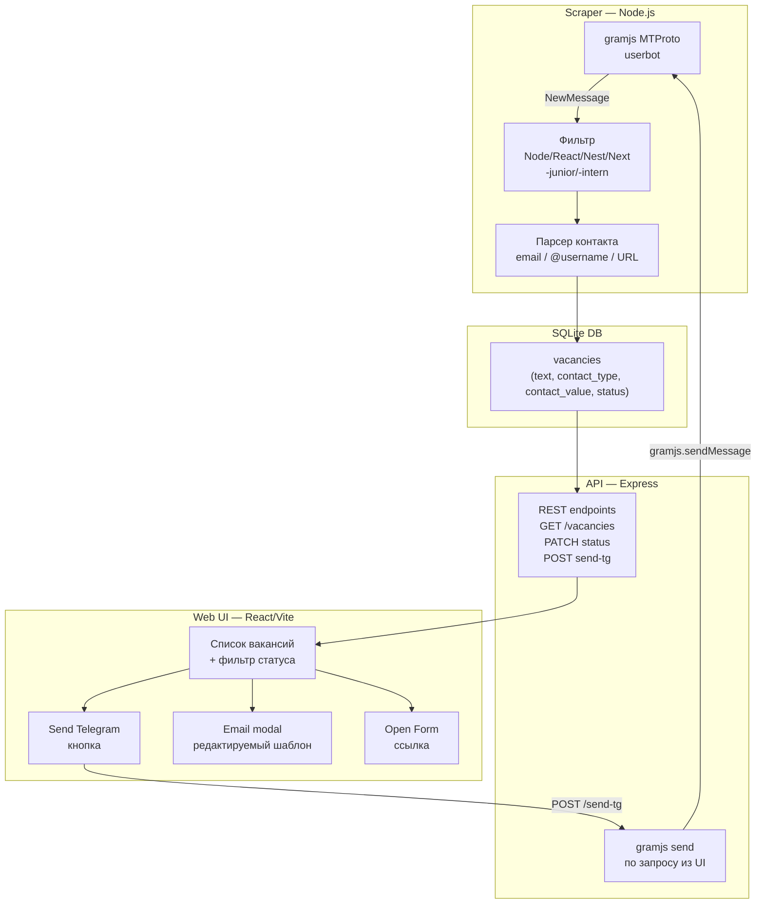

# Vacancy Tracker — обновлённый план

## Концепция: ручной отклик через UI, без автоспама

Scraper тихо собирает и фильтрует вакансии. Ты заходишь в веб-интерфейс, видишь актуальный список, и жмёшь нужную кнопку — бот отправляет сообщение в Telegram, открывает compose письма или ведёт на форму.

---

## Архитектура



---

## Стек

- **Node.js + TypeScript** — и scraper, и API
- **gramjs** (`npm install telegram`) — MTProto userbot: читать каналы + отправлять сообщения по команде
- **better-sqlite3** — единственное хранилище, без Redis/Postgres
- **Express** — лёгкий REST API, 4 эндпоинта
- **React + Vite + TailwindCSS** — UI дашборд
- **nodemailer** (опционально) — если нужна отправка email прямо из приложения, иначе `mailto:` ссылки

### BullMQ нужен? Нет
Вся обработка — event-хендлер gramjs + синхронная запись в SQLite. Нет тяжёлой фоновой работы.

### Webhook нужен? Нет
gramjs держит постоянное MTProto TCP-соединение. Webhook — это механизм Bot API, неприменим к userbot.

---

## Схема данных (SQLite)

```sql
CREATE TABLE vacancies (
  id          INTEGER PRIMARY KEY,
  channel     TEXT NOT NULL,        -- @nodejs_jobs
  message_id  INTEGER NOT NULL,
  text        TEXT NOT NULL,        -- полный текст поста
  preview     TEXT,                 -- первые 200 символов
  contact_type TEXT,                -- 'telegram' | 'email' | 'form' | 'unknown'
  contact_value TEXT,               -- @recruiter | hr@company.com | https://...
  tg_link     TEXT,                 -- ссылка на пост t.me/channel/123
  status      TEXT DEFAULT 'new',   -- 'new' | 'applied' | 'skipped' | 'saved'
  matched_at  DATETIME DEFAULT (datetime('now'))
);
```

---

## Парсинг контакта из текста вакансии

```typescript
export function parseContact(text: string): { type: string; value: string } {
  const email = text.match(/[\w.+-]+@[\w-]+\.[a-z]{2,}/i)?.[0];
  if (email) return { type: 'email', value: email };

  const form = text.match(/https?:\/\/[^\s]+(?:form|apply|job|hh\.ru)[^\s]*/i)?.[0];
  if (form) return { type: 'form', value: form };

  const tg = text.match(/@[\w]{4,}/)?.[0];
  if (tg) return { type: 'telegram', value: tg };

  return { type: 'unknown', value: '' };
}
```

---

## REST API (Express)

| Метод | Путь | Описание |
|---|---|---|
| `GET` | `/api/vacancies` | список, фильтры: `?status=new` |
| `PATCH` | `/api/vacancies/:id` | обновить status (applied/skipped/saved) |
| `POST` | `/api/vacancies/:id/send-telegram` | отправить CV-сообщение через gramjs |
| `GET` | `/api/templates` | шаблоны: telegram, email |

---

## UI — структура экрана

```
┌─────────────────────────────────────────────────────┐
│  Vacancy Tracker          [new: 12] [applied: 3]    │
├──────────┬──────────────────────────────────────────┤
│ Фильтры  │  Список вакансий                         │
│ ○ new    │  ┌──────────────────────────────────────┐│
│ ○ saved  │  │ @nodejs_jobs · 25 апр                ││
│ ○ applied│  │ Senior Node.js Developer, Remote...  ││
│ ○ skipped│  │ 📧 hr@company.com        [Написать ▼]││
│          │  └──────────────────────────────────────┘│
│          │  ┌──────────────────────────────────────┐│
│          │  │ @it_vacancies · 25 апр               ││
│          │  │ Fullstack NestJS/React, до 450k...   ││
│          │  │ 💬 @recruiter_kate    [Send TG] [Skip]││
│          │  └──────────────────────────────────────┘│
│          │  ┌──────────────────────────────────────┐│
│          │  │ @remote_jobs_ru · 24 апр             ││
│          │  │ Next.js developer, HealthTech...     ││
│          │  │ 🔗 hh.ru/vacancy/123  [Open Form]    ││
│          │  └──────────────────────────────────────┘│
└──────────┴──────────────────────────────────────────┘
```

---

## Шаблон CV-сообщения (Telegram)

```
Senior Backend / Fullstack | Node.js · NestJS · React · Next.js | HealthTech · B2B SaaS | 6 лет | Remote

Привет! Увидел вакансию в [channel], откликаюсь.

— NestJS microservices (J&J, 8+ сервисов, Kafka/CDC, Keycloak SSO)
— React/Next.js с SSR, TypeScript, Tanstack Query
— CI/CD: Jenkins → ArgoCD → K8s, Grafana observability

CV: https://... | tomashevichdmitry@gmail.com
```

---

## Шаблон Email (редактируемый в модале)

```
Тема: Senior Node.js / Fullstack Developer — отклик на вакансию

Добрый день!

Откликаюсь на вашу вакансию [должность].

Релевантный опыт:
...

Буду рад обсудить детали.
С уважением, Дмитрий
CV: [ссылка]
```

---

## Структура проекта

```
vacancy-tracker/
├── packages/
│   ├── scraper/          # gramjs + filter + parser
│   │   └── src/
│   │       ├── index.ts
│   │       ├── filter.ts
│   │       └── parser.ts
│   ├── api/              # Express REST + gramjs sender
│   │   └── src/
│   │       ├── server.ts
│   │       ├── routes/
│   │       └── telegram.ts
│   └── web/              # Vite + React dashboard
│       └── src/
│           ├── App.tsx
│           ├── VacancyList.tsx
│           └── EmailModal.tsx
├── db/
│   └── vacancies.sqlite
├── session/              # gramjs session (gitignore!)
├── .env
├── docker-compose.yml
└── package.json          # npm workspaces
```

---

## Деплой

### Вариант A — локально на Mac (самый простой)

Подходит, если ноутбук часто открыт. Scraper синхронизирует историю каналов при запуске, так что даже при оффлайне ничего не пропадёт.

```bash
npm run dev          # scraper + api + vite dev server
open http://localhost:5173
```

### Вариант B — Yandex Cloud Compute (рекомендация для постоянного мониторинга)

- Preemptible VM `e2-small` (2 vCPU, 2GB RAM): ~**400–600 ₽/мес**
- docker-compose: `scraper` + `api` + `nginx` (reverse proxy + UI static)
- UI доступен по `http://YOUR_IP` или через SSH-туннель `ssh -L 5173:localhost:5173 user@ip`

```yaml
# docker-compose.yml (упрощённо)
services:
  scraper:
    build: ./packages/scraper
    volumes: [./db:/app/db, ./session:/app/session]
    env_file: .env
  api:
    build: ./packages/api
    ports: ["3000:3000"]
    volumes: [./db:/app/db, ./session:/app/session]
    env_file: .env
  web:
    build: ./packages/web
    ports: ["80:80"]
```

### Альтернативы

- **Timeweb Cloud** VPS 199 ₽/мес — без оверхеда облака, просто PM2
- Не Railway/Render — нет persistent storage для SQLite и gramjs session

---

## Важные риски

- **Session файл** — хранить в `.gitignore`, не коммитить. При потере — повторная SMS-авторизация.
- Лучше использовать **отдельный номер** (не основной аккаунт Telegram) — купить eSIM или виртуальный номер.
- Scraper только **читает** каналы. Отправка — только по кнопке в UI, поэтому риска бана по спаму нет.
